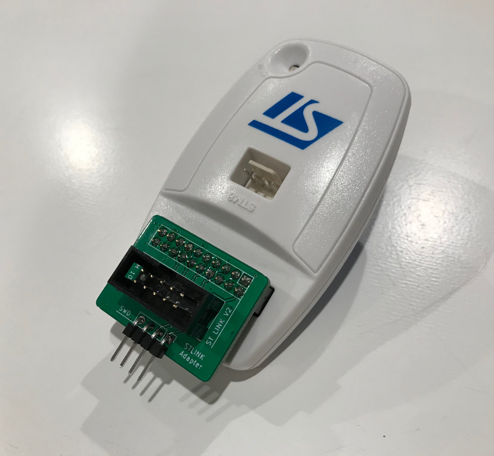
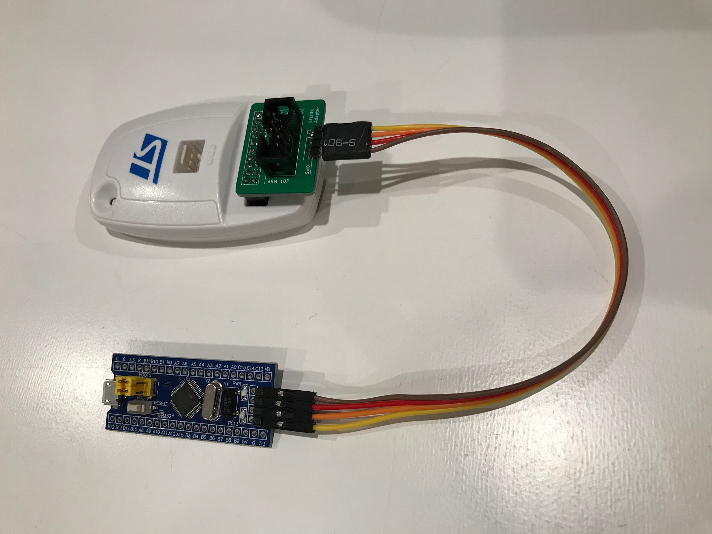
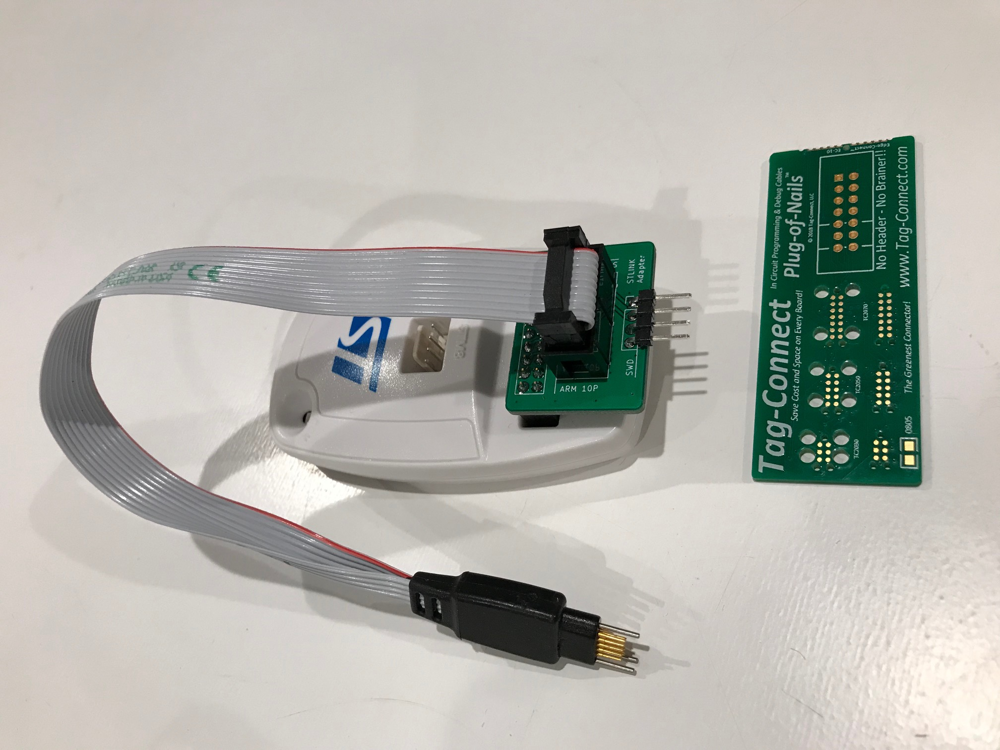

# STLINK_V2_Adapter
An adapter board for using 10-pin ARM debug cables and 4-pin SWD cables with the STLINK V2

# Project Description

After I was unable to find a simple adapter board for using 10-pin ARM cables and 4-pin SWD cables with the ST LINK, I decided to design my own!

# SWD Connector

# Tag-Connector Adapter

# License

MKE supports the open source hardware community by sharing hardware design files freely on GitHub!

Please support MKE by purchasing products on [Tindie](https://www.tindie.com/stores/mkengineering/)!

Designed by Mike Kushnerik for MKEngineering

Licensed under [Creative Commons Attribution-ShareAlike CC BY-SA 3.0](http://creativecommons.org/licenses/by-sa/3.0/)

All text above must be included in any redistribution!
